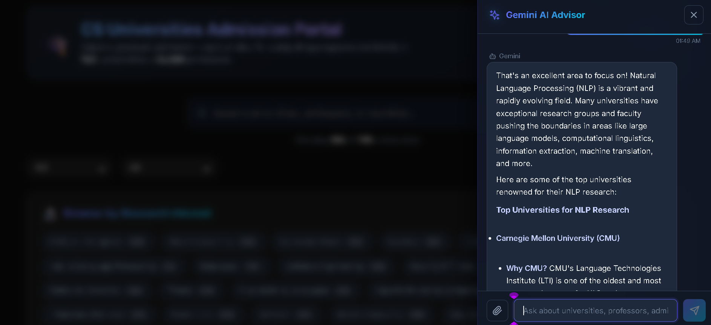
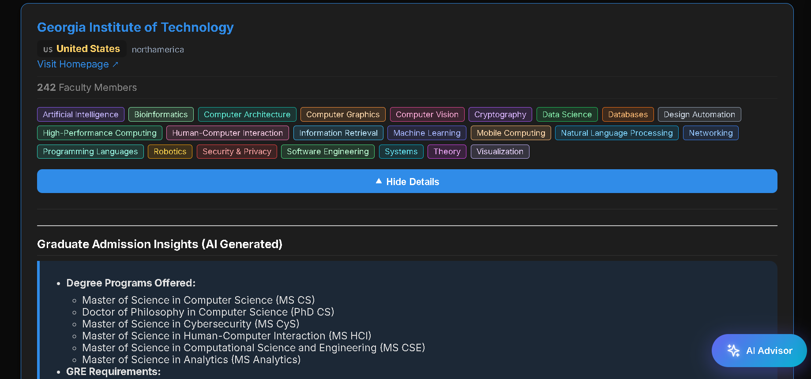
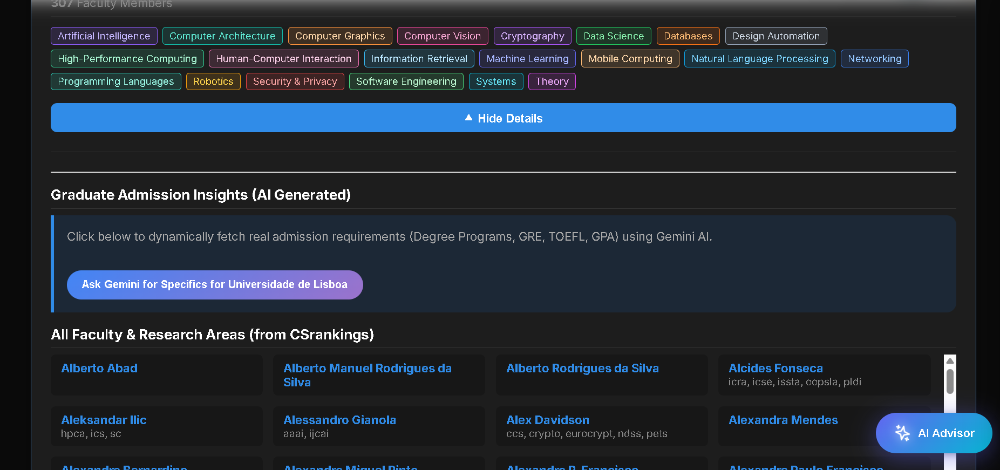
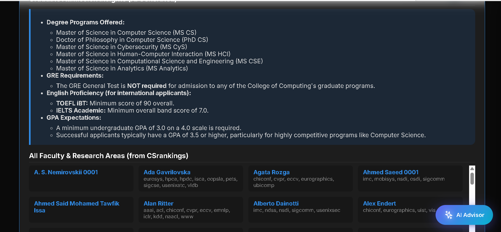
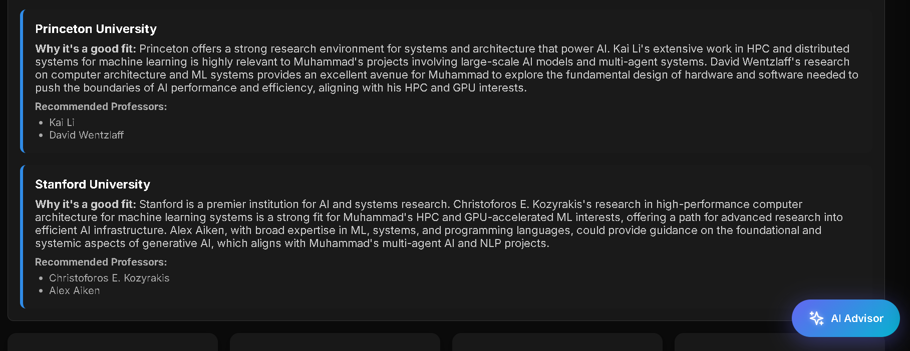

<div align="center">

# 🎓 CS Universities Admission Portal

### *Your AI-Powered Gateway to Graduate School*

[](https://react.dev/)
[](https://vitejs.dev/)
[](https://ai.google.dev/)
[](LICENSE)
[](https://github.com/code-with-idrees/CS-Universities-Admission/pulls)

<br/>

**Explore 500+ universities · 10,000+ professors · 20+ research areas · 60+ countries**

An intelligently designed, beautifully crafted platform that aggregates global Computer Science graduate program data from [CSRankings.org](http://csrankings.org/) and supercharges it with a built-in **Google Gemini AI advisor** — so you can find your dream university, the perfect professor, and get personalized admission insights, all in one place.

<br/>

[🚀 Get Started](#-quick-start) · [✨ Features](#-features) · [📸 Screenshots](#-screenshots) · [🏗️ Architecture](#%EF%B8%8F-architecture) · [🤝 Contributing](#-contributing)

---

</div>

<br/>

## 🔥 Why This Project?

Applying to grad school is overwhelming. You're juggling hundreds of university pages, sifting through faculty lists, comparing GRE/TOEFL requirements, and trying to match your research interests to the right professors — all while wondering if you're even a good fit.

**This portal solves that.** It puts every piece of information you need in a single, gorgeous interface — and backs it up with an AI advisor that actually understands your profile.

<br/>

## ✨ Features

### 🔍 Intelligent Search & Discovery
> Search across universities, professors, countries, and regions — all in real time with instant results.

- **Global Coverage** — Browse universities across **60+ countries** spanning North America, Europe, Asia, Australasia, South America, and Africa.
- **Instant Fuzzy Search** — Type a university name, professor, or country and see results filter in real time.
- **Geographic Filtering** — Narrow down by region and country with cascading dropdown filters.

---

### 🎯 Research Interest Matching
> Select your research interests and instantly see which universities and professors align with your goals.

- **22 Research Areas** — From *Machine Learning* and *Computer Vision* to *Cryptography*, *Robotics*, *HCI*, and *Bioinformatics*.
- **Color-Coded Tags** — Each research area has a unique, vibrant color for instant visual recognition.
- **Professor-Level Matching** — When you select interests, each university card shows exactly *how many* professors match, and expanding the card reveals *which* professors and *which* of their publication venues triggered the match.
- **Multi-Interest Support** — Select multiple interests simultaneously to find interdisciplinary programs.

---

### 🤖 Gemini AI Admissions Advisor
> A conversational AI chatbot powered by Google Gemini 2.5 Flash, always one click away.

- **Floating Action Button** — The "✨ AI Advisor" button is always accessible in the bottom-right corner.
- **Contextual Chat** — Ask questions like *"Best universities for NLP research?"*, *"Compare ML programs in USA vs Europe"*, or *"What are the GRE requirements for MIT?"*
- **Resume/CV Analysis** — Upload your PDF resume or transcript directly into the chat. The AI parses it client-side using `pdfjs-dist` and recommends specific universities and professors tailored to your background.
- **Conversation Memory** — The chatbot maintains context across your conversation for follow-up questions.
- **Quick Suggestion Chips** — Pre-built prompts to help you get started instantly.

---

### 📊 Deep University & Faculty Insights
> Expand any university card to reveal a wealth of information.

- **AI-Generated Admission Requirements** — Click "Ask Gemini" on any university to dynamically fetch real-time data on degree programs, GRE requirements, TOEFL/IELTS minimums, and GPA expectations.
- **Full Faculty Directory** — Scrollable grid of every professor with their name, research venues, and a direct link to their homepage.
- **Research Area Tags** — See all research interests covered by a university at a glance.

---

### 🌓 Premium Design & Theming
> A UI that feels as good as it looks.

- **Glassmorphism Design** — Frosted glass card surfaces with subtle blur effects and soft shadows.
- **Dark & Light Mode** — Toggle between a sleek dark theme and a clean light theme with a single click. Your preference is saved to `localStorage`.
- **Smooth Micro-Animations** — Hover effects, card lift transitions, pulsing match badges, and animated typing indicators.
- **Fully Responsive** — Pixel-perfect on mobile, tablet, and desktop.

<br/>

---

## 📸 Screenshots

<div align="center">

### 🌌 Main Dashboard — Dark Mode
*The primary interface with glassmorphism cards, search bar, region/country filters, and the floating AI Advisor button.*

</div>



---

<div align="center">

### 📖 University Card — Faculty & AI Insights
*Expand any university to see color-coded research interest tags, the Gemini-powered admission insights panel, and a scrollable faculty grid with direct homepage links.*

</div>



---

<div align="center">

### 🤖 AI-Generated Admission Requirements
*Click "Ask Gemini" to dynamically fetch real admission data — degree programs offered, GRE policy, TOEFL/IELTS minimums, GPA expectations — plus the full faculty directory below.*

</div>



---

<div align="center">

### 🧠 Gemini AI Advisor — Live Chat
*The conversational AI chatbot recommending top NLP universities with specific professors and research justifications, powered by Gemini 2.5 Flash.*

</div>



---

<div align="center">

### ☀️ Light Mode
*A clean, crisp light theme for daytime use — every component adapts gracefully.*

</div>



---

<br/>

## 🏗️ Architecture

```
┌─────────────────────────────────────────────────────────────┐
│                        Browser (Client)                     │
│                                                             │
│  ┌──────────┐  ┌──────────────┐  ┌───────────────────────┐  │
│  │ React 18 │  │ pdfjs-dist   │  │  CSS Glassmorphism    │  │
│  │ App.jsx  │  │ (PDF parser) │  │  Dark/Light Themes    │  │
│  └────┬─────┘  └──────┬───────┘  └───────────────────────┘  │
│       │               │                                     │
│       │  POST /generate, /chat, /recommend-profile          │
│       └───────────────┼─────────────────────────────────────┤
│                       │                                     │
├───────────────────────┼─────────────────────────────────────┤
│                Vite Dev Server (Middleware)                  │
│                       │                                     │
│         ┌─────────────▼──────────────┐                      │
│         │  aiApiPlugin (vite.config)  │                      │
│         │  • /generate  → Gemini API │                      │
│         │  • /chat      → Gemini API │                      │
│         │  • /recommend → Gemini API │                      │
│         └─────────────┬──────────────┘                      │
│                       │                                     │
├───────────────────────┼─────────────────────────────────────┤
│                       ▼                                     │
│          Google Gemini API (v1beta)                          │
│          Models: 2.5-flash → 2.5-flash-lite → 2.0-flash    │
│          (automatic fallback chain)                         │
└─────────────────────────────────────────────────────────────┘
```

| Layer | Technology | Purpose |
|-------|-----------|---------|
| **Frontend** | React 18 + Vite | Component-based UI with hot module replacement |
| **Styling** | Vanilla CSS | Glassmorphism, CSS variables, responsive design |
| **AI Proxy** | Vite Plugin (Custom Middleware) | Securely proxies Gemini API calls — API key never reaches the browser |
| **AI Engine** | Google Gemini 2.5 Flash | Admission insights, chat, and profile recommendation |
| **PDF Parsing** | pdfjs-dist | Client-side resume text extraction — no data sent to third parties |
| **Data Source** | CSRankings.org (Pre-processed JSON) | 500+ universities, 10,000+ faculty, 20+ research areas |
| **Icons** | Lucide React | Lightweight, consistent icon set |

<br/>

---

## 🚀 Quick Start

### Prerequisites

| Requirement | Version |
|-------------|---------|
| [Node.js](https://nodejs.org/) | v16+ |
| [Google Gemini API Key](https://aistudio.google.com/app/apikey) | Free tier works |

### Installation

```bash
# 1. Clone the repository
git clone https://github.com/code-with-idrees/CS-Universities-Admission.git
cd CS-Universities-Admission

# 2. Install dependencies
npm install

# 3. Fetch and build the database locally
npm run update-data

# 4. Set up your environment
cp .env.example .env
# Then edit .env and add your Gemini API key:
#   VITE_GEMINI_API_KEY=your_key_here

# 5. Start the dev server
npm run dev
```

Open `http://localhost:3000` in your browser. That's it — you're in! 🎉

### Available Scripts

| Command | Description |
|---------|-------------|
| `npm run dev` | Start development server with AI middleware |
| `npm run build` | Build for production |
| `npm run preview` | Preview the production build locally |
| `npm run update-data` | Re-fetch and process latest data from CSRankings |

<br/>

---

## 📁 Project Structure

```
CS-Universities-Admission/
├── public/
│   └── data/
│       └── processed-universities.json   # Pre-processed university data (8MB)
├── src/
│   ├── components/
│   │   ├── GeminiChat.jsx                # AI chatbot drawer with PDF upload
│   │   ├── UniversityList.jsx            # University card grid with expansion
│   │   ├── InterestFilter.jsx            # Research interest pill selector
│   │   ├── FilterBar.jsx                 # Region & country dropdowns
│   │   ├── ProfileUploader.jsx           # Resume upload + AI recommendations
│   │   ├── SearchBar.jsx                 # Global search component
│   │   └── Sidebar.jsx                   # Sidebar navigation
│   ├── services/
│   │   └── groqService.js               # API service with fallback logic
│   ├── data/
│   │   └── programs.js                   # Research areas, country maps, colors
│   ├── App.jsx                           # Root component with state management
│   ├── main.jsx                          # React entry point
│   └── index.css                         # Full design system (800+ lines)
├── vite.config.js                        # Vite config + Gemini AI proxy plugin
├── .env.example                          # Environment variable template
└── package.json
```

<br/>

---

## 🛡️ Security

- **API Key Protection** — The Gemini API key lives exclusively in `.env` and is proxied through a server-side Vite middleware plugin. It is **never** exposed to the client-side bundle.
- **Client-Side PDF Parsing** — Resume/CV files are parsed entirely in the browser using `pdfjs-dist`. No file data is ever sent to external servers — only the extracted text is passed to the AI.
- **`.env` is gitignored** — Your API keys will never be committed to version control.

<br/>

---

## 🤝 Contributing

Contributions, issues, and feature requests are welcome! Feel free to check the [issues page](https://github.com/code-with-idrees/CS-Universities-Admission/issues).

```bash
# Fork → Clone → Branch → Code → Push → PR
git checkout -b feature/amazing-feature
git commit -m "feat: add amazing feature"
git push origin feature/amazing-feature
```

<br/>

---

## 📜 License

This project is licensed under the **MIT License** — see the [LICENSE](LICENSE) file for details.

<br/>

---

<div align="center">

**Built with ❤️ by [Muhammad Idrees](https://github.com/code-with-idrees)**

*University and faculty data sourced from [CSRankings.org](http://csrankings.org/) under the [CC BY-NC-ND 4.0](https://creativecommons.org/licenses/by-nc-nd/4.0/) license. · AI powered by [Google Gemini](https://ai.google.dev/)*

<br/>

⭐ **If this project helped you, give it a star!** ⭐

</div>
