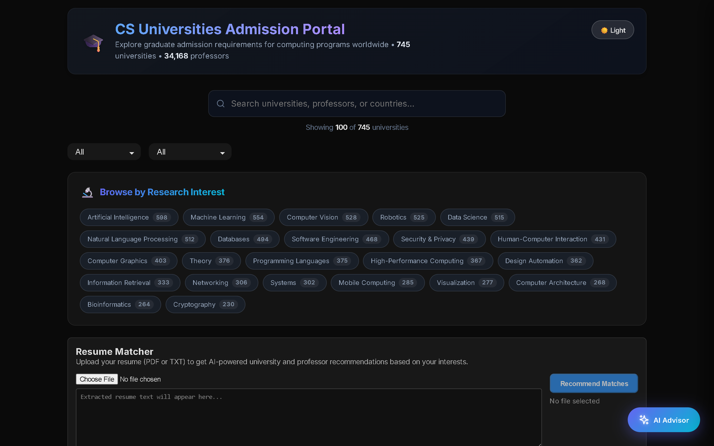
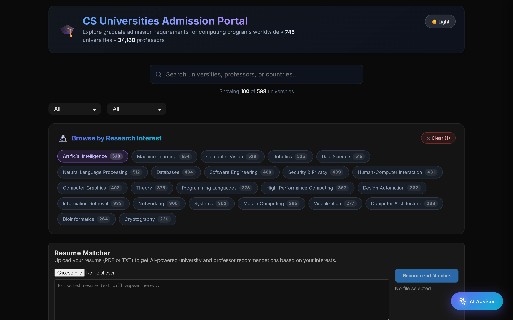
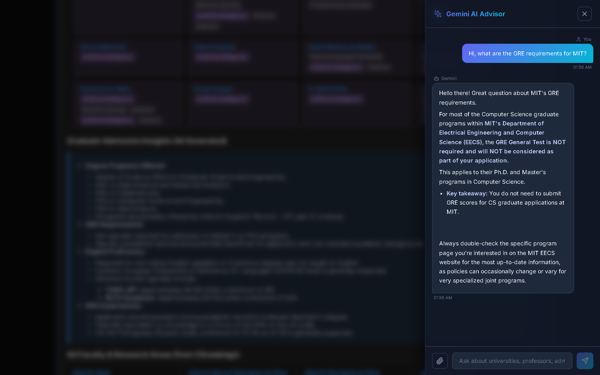
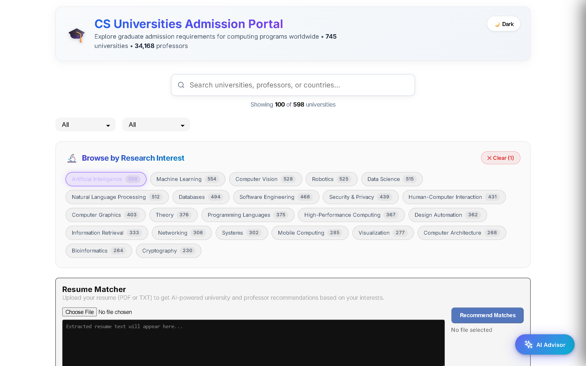
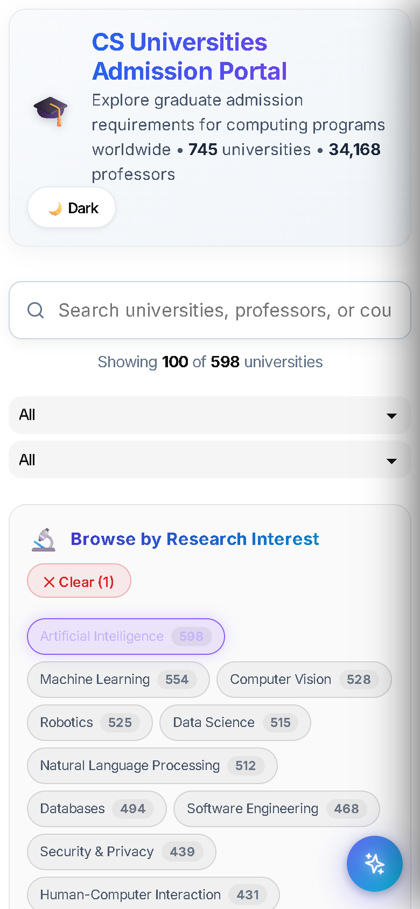

<div align="center">
  
  <h1 align="center">🎓 CS Universities Admission Portal</h1>

  <p align="center">
    <strong>A Beautiful, AI-Powered Dashboard for Prospective CS Graduate Students</strong>
  </p>

  <p align="center">
    <a href="#-features">Features</a> •
    <a href="#-screenshots">Screenshots</a> •
    <a href="#-architecture">Architecture</a> •
    <a href="#-quick-start">Quick Start</a>
  </p>
</div>

---

## 🌟 Overview

The **CS Universities Admission Portal** is a modern, responsive, and intelligently designed platform that aggregates computer science graduate program data from across the globe. Built specifically for prospective students, it takes the guesswork out of finding the right university, professor, and research lab.

Powered by **React**, **Vite**, and **Google Gemini AI**, the portal delivers a premium glassmorphism user experience with unparalleled filtering capabilities and a built-in AI advisor.

## ✨ Features

### 🔍 Smart Interest-Based Filtering
- **Research Area Breakdown**: Explore universities based on exact research interests (e.g., *Machine Learning, Computer Vision, Security, Systems, HCI*).
- **Match Insights**: Instantly highlights exactly which professors at a specific university match your selected research areas.
- **Geographic Filtering**: Filter by region (North America, Europe, Asia, etc.) and country.
- **Real-Time Search**: Search by university name, country, or even specific professor names instantly.

### 🤖 Gemini AI Admissions Advisor
- **Floating AI Chatbot**: Always available context-aware assistant ready to answer your admission questions.
- **Resume/Profile Analysis**: Upload your PDF resume/CV or transcript directly into the chat! The AI will parse the content and suggest universities and professors that fit your academic profile.
- **Admission Insights**: Dynamically ask about GRE requirements, TOEFL cutoffs, GPA expectations, and application deadlines for specific universities and get real-time answers.

### 📊 Deep Faculty Insights
- View complete lists of faculty and their precise research areas within each university card.
- Direct links to professor homepages to discover their lab and publications.

### 🌓 Premium UI/UX
- **Glassmorphism Design**: Modern frosted glass aesthetics with vibrant, color-coded research interest tags.
- **Theme Support**: Beautiful Dark and Light modes supported out-of-the-box.
- **Fully Responsive**: Works seamlessly on mobile, tablet, and desktop displays.

---

## 📸 Screenshots

### 🌌 Main Dashboard (Dark Mode)
The primary interface showcasing the premium glassmorphism design, search bar, and university list.


### 🎯 Smart Filtering by Research Interest
Selecting research interests highlights matching universities and specifically identifies which professors match your criteria.


### 📖 Deep Faculty & Admission Insights
Expand any university card to see a full list of faculty, direct links to their homepages, and a dedicated AI button to fetch live admission requirements.


### 🤖 Gemini AI Assistant (Resume Analysis)
Chat with the built-in Gemini advisor. Upload your resume (PDF/TXT) and let the AI find the best programs for your background.


### ☀️ Light Mode
A clean and crisp light theme for those who prefer it.


### 📱 Mobile Optimized
A flawless experience on the go.


---

## 🏗️ Architecture

- **Frontend**: React 18, Vite, standard CSS.
- **Data Processing**: Pre-processed JSON generated from the original `institutions_csrankings.csv`.
- **AI Integration**: A custom Vite plugin middleware runs alongside the dev server (`vite.config.js`) to securely proxy requests to the Google Gemini API, ensuring your API key is never exposed to the client.
- **PDF Parsing**: Client-side PDF text extraction using `pdfjs-dist` to securely pass your resume context to the AI advisor without storing it on any server.

---

## 🚀 Quick Start

### Prerequisites
- [Node.js](https://nodejs.org/) (v16+)
- A [Google Gemini API Key](https://aistudio.google.com/app/apikey)

### Installation

1. **Clone the repository**
   ```bash
   git clone https://github.com/code-with-idrees/CS-Universities-Admission.git
   cd CS-Universities-Admission
   ```

2. **Install dependencies**
   ```bash
   npm install
   ```

3. **Set up Environment Variables**
   Create a `.env` file in the root directory:
   ```env
   # Required: Get your API key from https://aistudio.google.com/app/apikey
   VITE_GEMINI_API_KEY=your_actual_api_key_here
   ```

4. **Start the Development Server**
   ```bash
   npm run dev
   ```

5. Open your browser and navigate to `http://localhost:3000`.

---

## 🤝 Contributing
Contributions, issues, and feature requests are welcome! Feel free to check the [issues page](https://github.com/code-with-idrees/CS-Universities-Admission/issues).

## 📜 License
This project is licensed under the MIT License - see the [LICENSE](LICENSE) file for details.

*Note: University and faculty data is originally sourced from CSRankings.*
