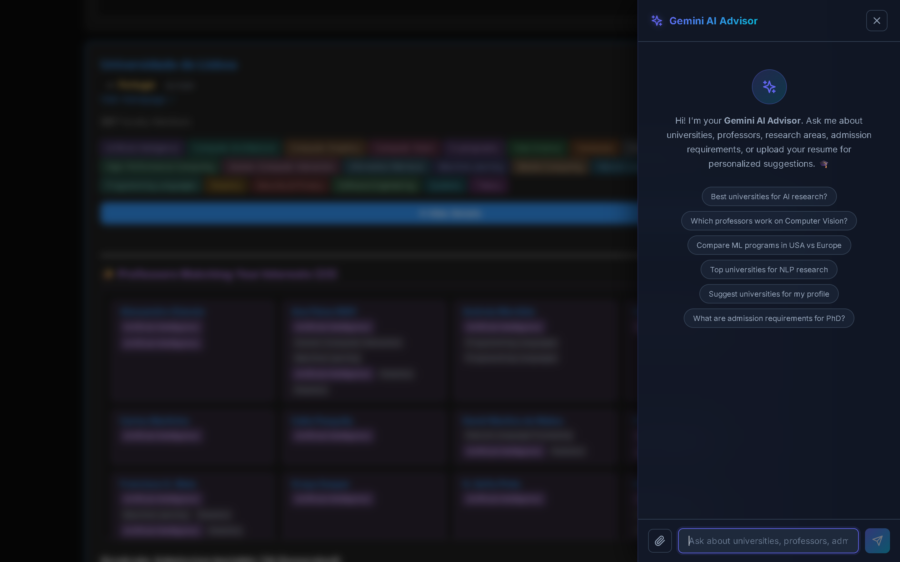
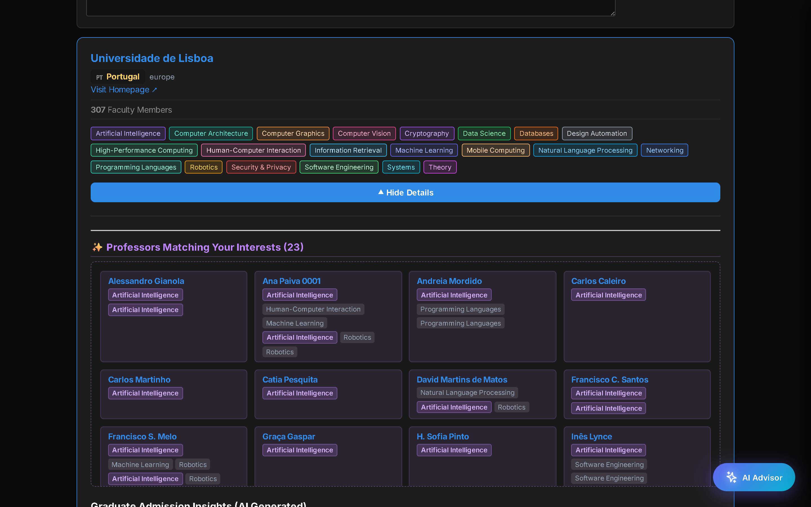

# 🎓 CS Universities Admission Portal


A beautifully designed, AI-powered web portal for prospective Computer Science graduate students. This application aggregates data from [CSrankings](http://csrankings.org/), processes it, and provides an elegant interface to filter, search, and explore universities, professors, and admission insights.

Powered by **React**, **Vite**, and **Google Gemini 2.5 Flash**, the portal offers a uniquely intelligent and interactive experience.

---

## ✨ Features

### 🔍 Smart Interest-Based Filtering
- **Research Area Breakdown**: Explore universities based on exact research interests (e.g., *Machine Learning, Computer Vision, Security, Systems, HCI*).
- **Match Insights**: Instantly highlights exactly which professors at a specific university match your selected research areas.
- **Geographic Filtering**: Filter by region (North America, Europe, Asia, etc.) and country.
- **Real-Time Search**: Search by university name, country, or even specific professor names instantly.


### 🤖 Gemini AI Admissions Advisor
- **Floating AI Chatbot**: Always available context-aware assistant.
- **Resume/Profile Analysis**: Upload your PDF resume/CV directly into the chat! The AI will parse the content and suggest universities and professors that fit your profile.
- **Admission Insights**: Ask about GRE requirements, TOEFL cutoffs, GPA expectations, and application deadlines for specific universities.



### 📊 Deep Faculty Insights
- View complete lists of faculty and their precise research areas within each university card.
- Direct links to professor homepages to discover their lab and publications.



### 🌓 Premium UI/UX
- **Glassmorphism Design**: Modern frosted glass aesthetics with vibrant, color-coded research interest tags.
- **Dark/Light Mode**: Full theme support out-of-the-box.
- **Fully Responsive**: Works beautifully on mobile, tablet, and desktop.


---

## 🚀 Quick Start

### Prerequisites
- [Node.js](https://nodejs.org/) (v16+)
- A [Google Gemini API Key](https://aistudio.google.com/app/apikey)

### Installation

1. **Clone the repository**
   ```bash
   git clone https://github.com/yourusername/cs-universities-admission.git
   cd cs-universities-admission
   ```

2. **Install dependencies**
   ```bash
   npm install
   ```

3. **Set up Environment Variables**
   Create a `.env` file in the root directory:
   ```env
   # Required: Get your API key from https://aistudio.google.com/app/apikey
   VITE_GEMINI_API_KEY=your_actual_api_key_here

   # Optional: Set to false if you don't want the UI to show mock data when the API fails
   VITE_GEMINI_ALLOW_FALLBACK=true
   ```

4. **Start the Development Server**
   ```bash
   npm run dev
   ```

5. Open your browser and navigate to `http://localhost:5173`.

---

## 🏗️ Architecture

- **Frontend**: React 18, Vite, standard CSS.
- **Data Processing**: Pre-processed JSON generated from the original `institutions_csrankings.csv`.
- **AI Integration**: A custom Node.js middleware runs alongside the Vite dev server (`vite.config.js`) to securely proxy requests to the Gemini API, hiding the API key from the client-side bundle.
- **PDF Parsing**: Client-side PDF text extraction using `pdfjs-dist` to securely pass context to the AI advisor.

---

## 🤝 Contributing

Contributions, issues, and feature requests are welcome!
Feel free to check the [issues page](https://github.com/yourusername/cs-universities-admission/issues).

1. Fork the project
2. Create your Feature Branch (`git checkout -b feature/AmazingFeature`)
3. Commit your changes (`git commit -m 'Add some AmazingFeature'`)
4. Push to the Branch (`git push origin feature/AmazingFeature`)
5. Open a Pull Request

---

## 📜 License

This project is licensed under the MIT License - see the [LICENSE](LICENSE) file for details.

*Note: University and faculty data is originally sourced from CSRankings.*
